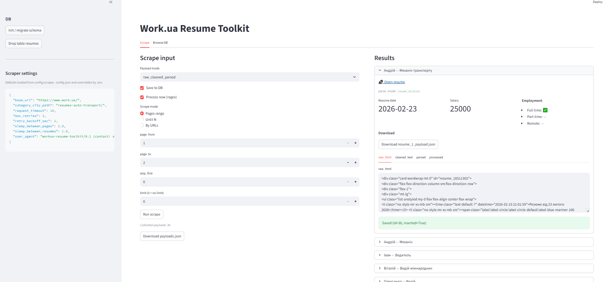
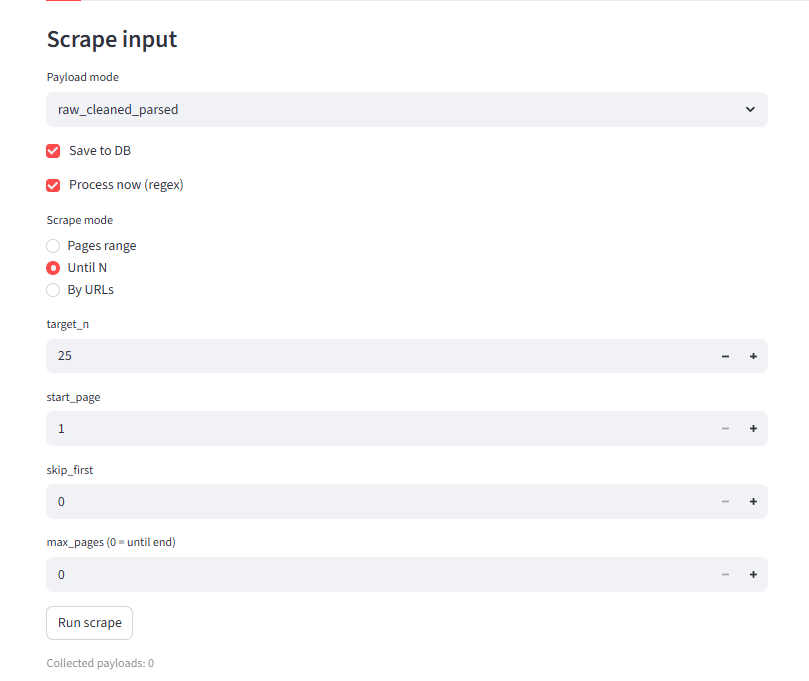
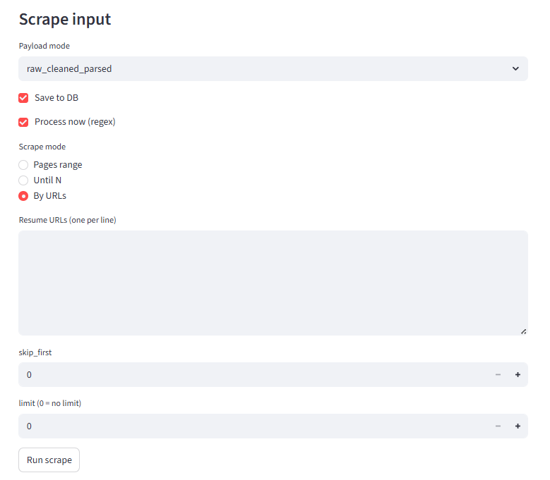
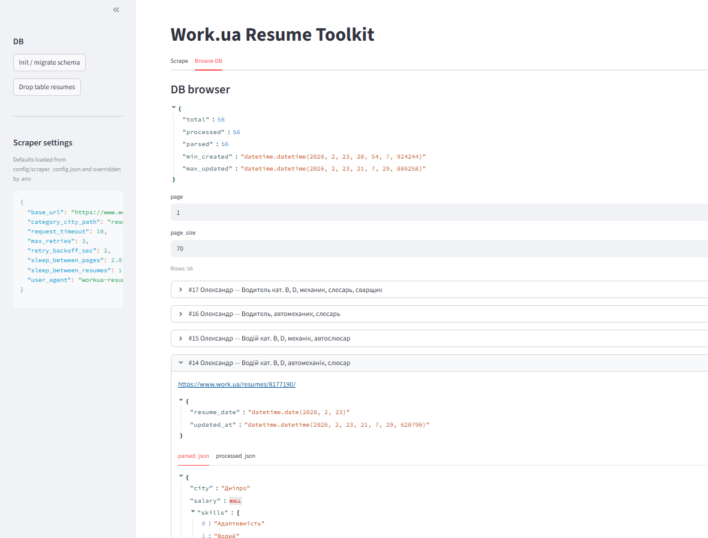
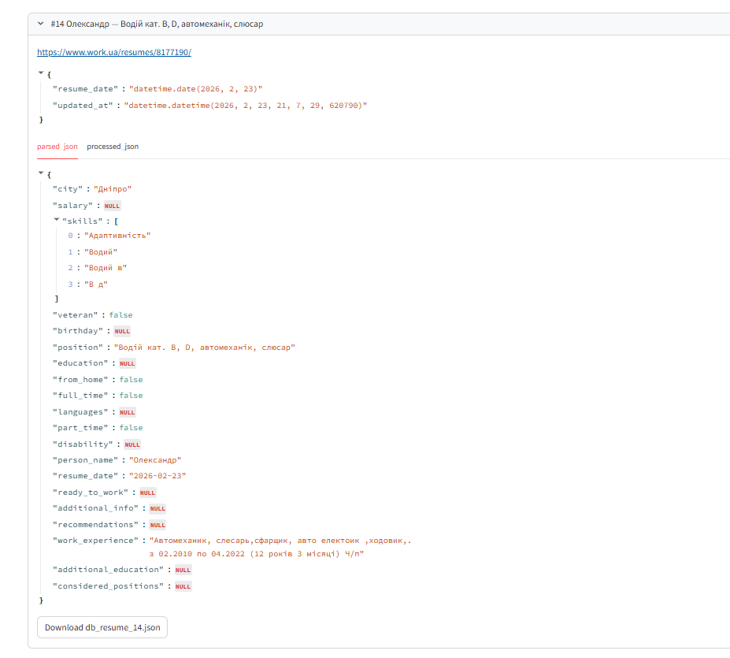

# Work.ua Resume Toolkit

A small, modular toolkit to **stream Work.ua resumes as JSON payloads** (scraper),
convert HTML into a **clean text representation**, extract **best-effort parsed fields**,
run **regex-based post-processing** (work experience / education structure, durations),
and optionally store, browse and export results via **PostgreSQL + Streamlit UI**.

The project is intentionally split into independent modules so you can use:
- only the scraper (JSON streaming),
- scraper + regex processing,
- or the full pipeline with DB + UI exports.

---

> ⚠️ Legal / ToS Disclaimer (Important)
>
> This repository is provided strictly for **educational and portfolio** purposes (code quality, modular design, parsing techniques).
> **Do not use it to collect or store real candidate data.**
>
> Work.ua content may contain personal data, and automated collection / storage of other users’ personal data may violate the website rules and/or applicable law.
> The Work.ua Terms state that users must not publish or use the service for collecting and storing personal data about other users:
> https://www.work.ua/about-us/conditions/
>
> If you need resume data for a real business use case, use official product/API offerings, obtain explicit permission, or negotiate a commercial license with the data provider.
>
> By using this code, you assume full responsibility for compliance with the target website’s ToS and all applicable laws. 
> The author provides no warranties and no guarantees of long-term compatibility.
---

## What this is / what this is not

- ✅ A modular reference implementation of a **scraping → parsing → processing → storage → UI** pipeline.
- ✅ Streaming-first design (generators), with optional DB persistence.
- ❌ Not a production scraper and not a data collection tool for real candidate data.
- ❌ No PDF/DOC parsing and no bypassing of anti-bot protections.


## Features

- **Scraper module** (`workua_toolkit.scraper`)
  - Streams resumes as **JSON payloads** (generators / iterators)
  - Modes: **pages range**, **until N resumes**, **explicit URLs**
  - Supports `skip_first` and custom `start_page` for resuming long runs
  - Payload modes:
    - `raw` — only `raw_html`
    - `raw_cleaned` — `raw_html` + `cleaned_text`
    - `raw_cleaned_parsed` — `raw_html` + `cleaned_text` + `parsed` fields (best-effort)
  - Notes:
    - The example extraction includes **driving categories** because the original dataset focus was driver-related resumes.
      Treat it as a domain-specific extractor you can disable or extend.
  - Limitations / skipped formats:
    - Targets **HTML resumes created via Work.ua forms** with structured sections.
    - The following formats are currently **not supported** and are skipped:
      - Resumes uploaded as **files** (“Файл / Завантажений файл”) — no PDF/DOC parsing in this project
      - Short **“Business card / Візитка”** resumes — these contain minimal structured data and do not follow the same layout as full resumes.


- **Regex processing module** (`workua_toolkit.processing`)
  - Converts best-effort text fields into structured items:
    - work experience items, education items
  - Computes summary features:
    - months/years per position (with optional semantic grouping)
    - `normalized_skill -> months` mapping from duties (optional semantic matcher)
  - TODO / Not implemented yet:
    - Parsing for sections like **Additional Education** and **Additional Info** into structured items is not implemented (only best-effort text extraction).

- **PostgreSQL storage** (`workua_toolkit.db`)
  - Single table `resumes`:
    - `raw_html`, `cleaned_text`, `parsed_json` (JSONB), `processed_json` (JSONB)
    - timestamps + pagination + basic stats

- **Streamlit UI** (`workua_toolkit.ui`)
  - Minimal interface to scrape, save, process and browse
  - Download per-resume exports: full payload JSON, raw_html, cleaned_text, processed_json

- **Semantic similarity layer (optional)** (`workua_toolkit.semantic`)
  - Semantic matching is **not required**. When enabled, it can improve:
    - **grouping similar job titles** (e.g., “Sales Manager” vs “Sales Lead”),
    - **grouping similar skill names** (e.g., “B category” vs “category B” / “водій кат. B”),
  - Provides a lightweight interface:
    - `similarity(a, b)` -> float

---

## Project layout

```
workua-resume-toolkit/
  src/workua_toolkit/
    config/
    logging/
    scraper/
    processing/
    db/
    ui/
    scripts/
    semantic/
      similarity_matcher.py   # optional semantic matcher (installed via [semantic] extras)
docs/images/
docs/examples/
```

## Architecture (high level)

```
Scraper (HTML → payload: raw/cleaned/parsed)
        ↓
Regex Processing (structure, dates, experience)
        ↓
[Optional] Semantic Similarity Layer (titles, skills)
        ↓
DB / UI / Export
```

**Payload** is the “transport format” of the project (a stable JSON-like dict schema).
DB and UI operate on payloads and `processed_json` produced by the processor.


## Data model

PostgreSQL table `resumes` stores:
- `source_url` (unique)
- `raw_html`, `cleaned_text`
- `parsed_json` (best-effort fields from the page)
- `processed_json` (regex-first structured output)
- `created_at`, `updated_at`

## Example data output

The toolkit produces structured JSON artifacts at different stages of the pipeline.

### Database row example

A full example of a stored resume record:

👉 `docs/examples/db_row.sample.json`

This example demonstrates:

- raw parsed fields extracted from the Work.ua page (`parsed_json`)
- regex-first structured output (`processed_json`)
- timestamps and metadata stored in PostgreSQL

**Key differences:**

| Field | Description |
|------|------|
| `parsed_json` | best-effort extraction from HTML sections |
| `processed_json` | structured post-processing (durations, normalization, grouping) |

> Note: values depend on resume structure and extraction heuristics.

## Quickstart

```bash
git clone https://github.com/supersokol777/workua-resume-toolkit.git
cd workua-resume-toolkit
python -m venv .venv
source .venv/bin/activate
pip install -e ".[db,ui]"
cp .env.example .env  # edit DB credentials
python scripts/init_db.py
streamlit run src/workua_toolkit/ui/app.py
```
---

## Setup

### 0) Clone

```bash
git clone https://github.com/supersokol777/workua-resume-toolkit.git
cd workua-resume-toolkit
```

### 1) Create venv

```bash
python -m venv .venv
source .venv/bin/activate  # Windows: .venv\Scripts\activate
```

### 2) Install dependencies

#### Option A (recommended): editable install via pyproject

**Base install**(scraper + parsing + regex processing):
```bash
pip install -e .
```

**Typical local usage** (DB + Streamlit UI):
```bash
pip install -e ".[db,ui]"
```

**Optional semantic matcher**:
> Semantic matcher adds heavy dependencies (`sentence-transformers`, `faiss`). The toolkit works without it.
```bash
pip install -e ".[semantic]"
```

Full installation:
```bash
pip install -e ".[db,ui,semantic]"
```


#### Option B: install via requirements.txt

```bash
pip install -r requirements.txt # (core + db + ui)
```

Optional semantic mode:

```bash
pip install -r requirements-semantic.txt
```

requirements*.txt are provided for convenience; pyproject.toml is the source of truth.

### 3) Configure environment variables

This project reads configuration from environment variables. You can provide them in two ways:

**Option A: copy and edit `.env` file (recommended for local dev)**:

```bash
cp .env.example .env
# then edit .env 
```
Set PostgreSQL credentials, and optionally `WORKUA_CATEGORY_CITY_PATH`.
`load_settings()` calls `load_dotenv()` automatically, so `.env` will be loaded if present.


**Option B: Export variables manually**:
```bash
export DB_HOST=localhost
export DB_PORT=5432
...
```

`.env` is optional. If it is missing, the toolkit will still work as long as the variables are set in your environment.

### 4) Init database

```bash
python src/workua_toolkit/scripts/init_db.py
```

### 5) Run Streamlit UI

```bash
streamlit run src/workua_toolkit/ui/app.py
```
---

## Stability & Compatibility

This toolkit relies on Work.ua page markup and text patterns. Extraction quality depends on resume structure and may require tuning for new layouts.The target website can change at any moment, so the scraper/parser may degrade or stop working without notice.

**Last manual sanity check:** 2026-02-23 (public resume pages, Ukrainian UI). tested on: `resumes-auto-transport/` category

If parsing starts failing:
- start by checking `workua_toolkit.scraper.parsing` (section titles / label extraction),
- then update DOM selectors in `workua_toolkit.scraper.workua`.

This project does not guarantee long-term compatibility with Work.ua. If it breaks, treat it as an exercise in maintaining a scraping/parsing pipeline.

---

## Usage (library)

### Scraping

#### Payload modes

All scraper methods yield **payload dictionaries** with a stable schema. `payload_mode` controls how much data is included:

- `PayloadMode.RAW` — only `raw_html`
- `PayloadMode.RAW_CLEANED` — `raw_html` + `cleaned_text`
- `PayloadMode.RAW_CLEANED_PARSED` — `raw_html` + `cleaned_text` + `parsed` fields (best-effort)

#### Streaming scraping (iterator methods)

These methods return **generators** and are recommended for larger jobs or DB persistence.

**Scrape a pages range (streamed payloads)**

```python
from workua_toolkit.config.settings import load_settings
from workua_toolkit.scraper.workua import WorkUAScraper, PayloadMode

s = load_settings()
scraper = WorkUAScraper(s.scraper)

for payload in scraper.iter_resumes_by_pages(
    page_from=1,
    page_to=2,
    payload_mode=PayloadMode.RAW_CLEANED_PARSED,
):
    print(payload["source_url"], payload["parsed"]["person_name"])
```
Parameters:

- `page_from/page_to`: inclusive page range to scan
- `payload_mode`: choose how heavy/light the payload is

**Scrape until N resumes (with start page and skip)**
```python
for payload in scraper.iter_resumes_until(
    target_n=50,
    start_page=10,       # start scanning from page 10
    skip_first=20,       # skip first 20 resumes encountered (useful for resuming)
    max_pages=200,       # safety cap; stop after scanning N pages
    payload_mode=PayloadMode.RAW_CLEANED,
):
    ...
```
Parameters:
- `target_n`: stop when this many payloads have been collected
- `start_page`: do not start from page 1
- `skip_first`: skip first K resumes encountered across scanning (resume a long job)
- `max_pages`: safety guard if pages end / layout changes

**Scrape explicit resume URLs**
```python
urls = [
  "https://www.work.ua/resumes/123456/",
  "https://www.work.ua/resumes/789101/",
]

for payload in scraper.iter_resumes_by_urls(
    urls,
    skip_first=0,
    limit=None,  # or an integer
    payload_mode=PayloadMode.RAW_CLEANED_PARSED,
):
    ...
```

### Convenience: collect into a list

For small experiments or tests you can **collect streamed payloads into memory** instead of iterating manually:

```python
# Collect resumes from a pages range
items = scraper.scrape_resumes_by_pages(page_from=1, page_to=2)
print(len(items))

# Collect until N resumes
items = scraper.scrape_resumes_until(target_n=20, start_page=1)
print(len(items))

# Collect from explicit URLs
urls = [
    "https://www.work.ua/resumes/123456/",
    "https://www.work.ua/resumes/789101/",
]
items = scraper.scrape_resumes_by_urls(urls)
print(len(items))

```

⚠️ Avoid collecting large volumes into a list; prefer streaming (`iter_*` methods) together with DB persistence for long-running or large-scale scraping.

### Processing
**Process a single payload (regex-first)**
```python
from workua_toolkit.processing.processor import UniversalResumeProcessor

processor = UniversalResumeProcessor(matcher=None)  # lightweight mode
processed = processor.process_payload(payload)
```

**Process a stream (batch)**
```python
processed_batch = []
for payload in scraper.iter_resumes_until(target_n=100, start_page=1):
    processed = processor.process_payload(payload)
    processed_batch.append((payload, processed))
```

**Optional: semantic matcher (advanced)**

Semantic matching is **not required**. When enabled, it can improve:
- grouping similar job titles (e.g., “Sales Manager” vs “Sales Lead”),
- clustering semantically related phrases across resume sections.
- mapping duty phrases to known skills.

The processor supports an **optional semantic matcher** with the interface:

```python
class SimilarityMatcher:
    def similarity(self, a: str, b: str) -> float: ...
```

By default the processor runs in **lightweight regex-only mode**:

```python
from workua_toolkit.processing.processor import UniversalResumeProcessor
processor = UniversalResumeProcessor(matcher=None)
```

**Using the built-in semantic matcher**

If you install the optional dependencies (`pip install -e ".[semantic]"`), you can use the provided matcher:

```python
from workua_toolkit.semantic.similarity_matcher import SemanticSimilarityMatcher
from workua_toolkit.processing.processor import UniversalResumeProcessor

matcher = SemanticSimilarityMatcher(
    model_name="paraphrase-multilingual-MiniLM-L12-v2",
    threshold=0.75,
)

processor = UniversalResumeProcessor(matcher=matcher)
processed = processor.process_payload(payload)
```
This matcher uses sentence-transformer embeddings and cosine similarity to compare arbitrary text fragments (skills, titles, duties, etc.).
It is heavier and slower than pure regex processing, but may produce better grouping of semantically similar phrases.

**Writing your own matcher**

You are encouraged to implement your own matcher depending on your domain:

class MyMatcher:
    def similarity(self, a: str, b: str) -> float:
        # your custom logic (embeddings, rules, taxonomy, etc.)
        return score

Then:

processor = UniversalResumeProcessor(matcher=MyMatcher())

The toolkit intentionally keeps the matcher dependency optional to allow **lightweight usage without ML models.**

---

## Usage (CLI)

**Scrape 50 resumes (NDJSON to stdout)**:
```bash
workua-toolkit scrape --target-n 50
```
**Scrape pages 1..2 to file**:
```bash
workua-toolkit scrape --pages 1 2 --out resumes.ndjson
```
**Scrape explicit URLs**:
```bash
workua-toolkit scrape --urls https://www.work.ua/resumes/123/ https://www.work.ua/resumes/456/ --out out.ndjson
```
---

## Screenshots
> Note: screenshots are from local runs and may differ from your environment.

### 1) Streamlit UI (overview)
Minimal UI for scraping, optional regex processing, and DB persistence.  
Left sidebar shows DB actions and effective scraper settings loaded from config + .env overrides.


### 2) Scrape mode: Until N
Streaming scrape mode: crawl starting from `start_page` until `target_n` resumes are collected.  
Useful for incremental runs and quick sampling without specifying an end page.


### 3) Scrape mode: By URLs
Deterministic scrape mode: provide explicit resume URLs (one per line).  
Best for reproducible debugging of parser/regex extraction and for building small example datasets.


### 4) DB browser (overview)
Browse stored resumes with pagination and basic DB stats.  
Each row expands into the original parsed fields and the derived regex-processed structure.


### 5) DB browser: parsed_json
`parsed_json` view: best-effort extraction directly from the Work.ua HTML page  
(name, position, salary, employment flags, skills, free-text experience/education blocks, etc.).


### 6) DB browser: processed_json
`processed_json` view: regex-first post-processing outputs  
(structured work/education items with date ranges, months/years totals, normalized skills, category hints, warnings).


---

## Contributing

Issues and PRs are welcome, but please note this project is primarily a portfolio/educational artifact and may not be actively maintained.

## License

MIT (see `LICENSE`).
